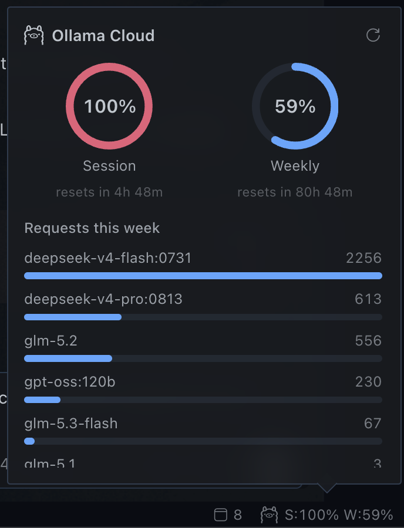

# Ollama Cloud Usage

A [Hermes](https://github.com/NousResearch/hermes) desktop plugin that shows your
**Ollama Cloud** usage right in the statusbar — your monthly usage-credit pool and
a per-model request breakdown, straight from the official
`GET https://ollama.com/api/usage` endpoint. No cookie scraping, no HTML parsing.



## What it shows

- **Statusbar chip** — the Ollama llama logo + a compact `M:28%` summary of the
  **M**onthly usage-credit pool used. Color-coded: accent under 75%, yellow ≥75%,
  red ≥90%.
- **Click the chip** → a popover with:
  - A **ring gauge** for "This month" — the share of your monthly usage credits
    you've burned — labeled *resets on plan anniversary* (see the reset-time note).
  - A per-model bar chart — **"This month"** — sorted by request count, so you can
    see at a glance which models are eating your monthly quota.
- **Auto-refresh** every 60s, a manual refresh button in the popover, and a
  command-palette action (`Ollama Cloud: Refresh usage`).
- **Hideable** — right-click the statusbar and toggle *Ollama Cloud* on/off,
  exactly like the built-in chips.

## Architecture

Two halves of one plugin package (the same pattern Hermes' built-in dashboard
plugins use):

```
ollama-cloud-usage/
├── plugin.yaml                 # native plugin manifest
├── __init__.py                 # agent-loader entry (no-op register)
├── dashboard/
│   ├── manifest.json           # { name, label, icon, version, api }
│   └── plugin_api.py           # FastAPI router → /api/plugins/ollama-cloud-usage/usage
└── desktop/
    └── plugin.js               # statusbar chip + popover, via ctx.rest('/usage')
```

The desktop JS calls `ctx.rest('/usage')`, which the SDK routes to
`/api/plugins/ollama-cloud-usage/usage`. The Python backend proxies
`https://ollama.com/api/usage` using the key from `OLLAMA_API_KEY` (environment)
or `~/.hermes/.env`, and normalizes it for the UI.

> **Remote/OAuth setups:** the desktop UI (`desktop/plugin.js`) loads on the
> machine running the app, but `ctx.rest` is answered by whichever backend the
> app is connected to. If your desktop app connects to a remote Hermes over
> OAuth, install the **whole package on that backend host** too, so the
> `/api/plugins/ollama-cloud-usage/usage` route is mounted where the request
> actually lands.

## Install

The whole plugin is ONE folder — the Python backend and the desktop UI ship
together.

### Recommended — `hermes plugins install`

```bash
# Installs into ~/.hermes/plugins/ollama-cloud-usage and prompts to enable
hermes plugins install mpartipilo/ollama-cloud-usage

# Restart the backend so the /api/plugins/... route mounts
hermes serve   # or restart your existing serve/gateway process
```

`mpartipilo/ollama-cloud-usage` is the `owner/repo` shorthand; a full Git URL
(`hermes plugins install https://github.com/mpartipilo/ollama-cloud-usage`)
works identically. Neither needs a plugin index — they resolve straight from
GitHub.

### Manual (clone)

```bash
git clone https://github.com/mpartipilo/ollama-cloud-usage \
  ~/.hermes/plugins/ollama-cloud-usage
hermes plugins enable ollama-cloud-usage   # adds it to plugins.enabled
hermes serve                                # restart to mount the route
```

### Finish in the app

In the desktop app: **Settings ▸ Plugins → toggle "Ollama Cloud Usage" on**,
then fully quit + relaunch (⌘Q, not just closing the window) so the renderer
picks up `plugin.js`.

## Requirements

- `OLLAMA_API_KEY` in `~/.hermes/.env` (or the environment) — your Ollama Cloud
  API key.
- The Hermes **desktop app** (the chip + popover are desktop UI).

## A note on reset times

The Ollama usage API does **not** return reset timestamps. Since Sept 2026,
Ollama measures usage as a **monthly usage-credit pool** (per-token billing; the
monthly reset is on your plan's **subscription anniversary** — the same day of
month your plan started). That anniversary is **not** in the `/api/usage`
payload: the only time data there is `activity.period`, a rolling
`last_4_weeks` window unrelated to the anniversary. So the plugin labels the
gauge *resets on plan anniversary* rather than faking a countdown.

`usage` is a 0–1 fraction of your monthly allowance.

## License

MIT © mpartipilo
